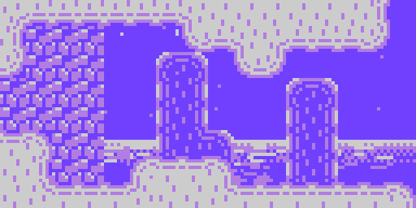
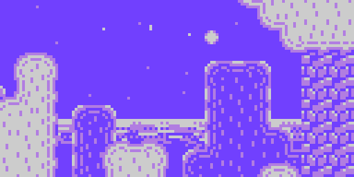

Nothing makes you feel like you're playing a real game like parallax scrolling; you know, like that feeling you get when you're on a long car ride and the mountains move so slowly but the street signs whoosh past you. It's that feeling that makes you feel like you're really going somewhere, and it's a cheap and easy way to add a touch of beauty and realism to your game.

Same setup as the previous two examples, but now we're going to add some extra graphics for the stuff that's going on in the background.

<pre><code>CON
    _clkmode = xtal1|pll16x
    _xinfreq = 5_000_000
OBJ

    lcd     :   &quot;LameLCD&quot; 
    gfx     :   &quot;LameGFX&quot;
    map     :   &quot;LameMap&quot;
    ctrl    :   &quot;LameControl&quot;</code></pre>

Here's what it's going to have.

You've got your front level map.

<pre><code>    mp      :   &quot;map_cave&quot;</code></pre>

But now you've also got another map for the background tiles.

<pre><code>    mp2     :   &quot;map_cave2&quot;</code></pre>

Same tileset as before.

<pre><code>    tileset :   &quot;gfx_cave&quot;</code></pre>

But we're also going to add a beautiful backdrop to admire!

<pre><code>    bkdrop  :   &quot;gfx_cavelake&quot;

VAR
    long    xoffset, yoffset
    long    offsetw, offseth
    long    w1, h1, w2, h2
    long    dx, dy

PUB Main
    lcd.Start(gfx.Start)

    map.Load(tileset.Addr, mp.Addr)
    w1 := map.GetWidth&lt;&lt;3-128
    h1 := map.GetHeight&lt;&lt;3-64

    map.Load(tileset.Addr, mp2.Addr)
    w2 := map.GetWidth&lt;&lt;3-128
    h2 := map.GetHeight&lt;&lt;3-64

    dx  := w1/w2
    dy  := h1/h2

    yoffset := 64

    repeat
        ctrl.Update
        if ctrl.Left
            if xoffset &gt; 0
                xoffset--
        if ctrl.Right
            if xoffset &lt; w1
                xoffset++
        if ctrl.Up
            if yoffset &gt; 0
                yoffset--
        if ctrl.Down
            if yoffset &lt; h1
                yoffset++

        gfx.Blit(bkdrop.Addr)

        gfx.InvertColor(True)
        map.Load(tileset.Addr, mp2.Addr)
        map.Draw(xoffset/dx, yoffset/dy)
        gfx.InvertColor(False)

        map.Load(tileset.Addr, mp.Addr)
        map.Draw(xoffset, yoffset)

        lcd.DrawScreen</code></pre>

When you run your code, it will look completely flipping awesome. Why? Because now you don't just have the single tilemap, but two, and they're parallaxed against a backdrop, which creates a nice depth-of-field effect.

But don't take my word for it; see for yourself!

I mean, seriously, how awesome.

Look at that eye-popping display!

<h2 id="complete-code">Complete Code</h2>
<pre><code>&#39; 03_maps/03_ParallaxScrolling.spin
&#39; -------------------------------------------------------
&#39; SDK Version: 0.0.0
&#39; Copyright (c) 2015 LameStation LLC
&#39; See end of file for terms of use.
&#39; -------------------------------------------------------
CON
    _clkmode = xtal1|pll16x
    _xinfreq = 5_000_000
OBJ

    lcd     :   &quot;LameLCD&quot; 
    gfx     :   &quot;LameGFX&quot;
    map     :   &quot;LameMap&quot;
    ctrl    :   &quot;LameControl&quot;
    mp      :   &quot;map_cave&quot;
    mp2     :   &quot;map_cave2&quot;
    tileset :   &quot;gfx_cave&quot;
    bkdrop  :   &quot;gfx_cavelake&quot;

VAR
    long    xoffset, yoffset
    long    offsetw, offseth
    long    w1, h1, w2, h2
    long    dx, dy

PUB Main
    lcd.Start(gfx.Start)

    map.Load(tileset.Addr, mp.Addr)
    w1 := map.GetWidth&lt;&lt;3-128
    h1 := map.GetHeight&lt;&lt;3-64

    map.Load(tileset.Addr, mp2.Addr)
    w2 := map.GetWidth&lt;&lt;3-128
    h2 := map.GetHeight&lt;&lt;3-64

    dx  := w1/w2
    dy  := h1/h2

    yoffset := 64

    repeat
        ctrl.Update
        if ctrl.Left
            if xoffset &gt; 0
                xoffset--
        if ctrl.Right
            if xoffset &lt; w1
                xoffset++
        if ctrl.Up
            if yoffset &gt; 0
                yoffset--
        if ctrl.Down
            if yoffset &lt; h1
                yoffset++

        gfx.Blit(bkdrop.Addr)

        gfx.InvertColor(True)
        map.Load(tileset.Addr, mp2.Addr)
        map.Draw(xoffset/dx, yoffset/dy)
        gfx.InvertColor(False)

        map.Load(tileset.Addr, mp.Addr)
        map.Draw(xoffset, yoffset)

        lcd.DrawScreen

</code></pre>
