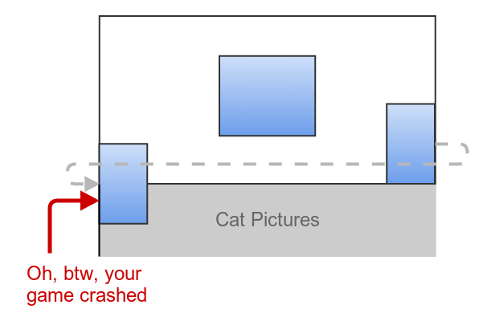
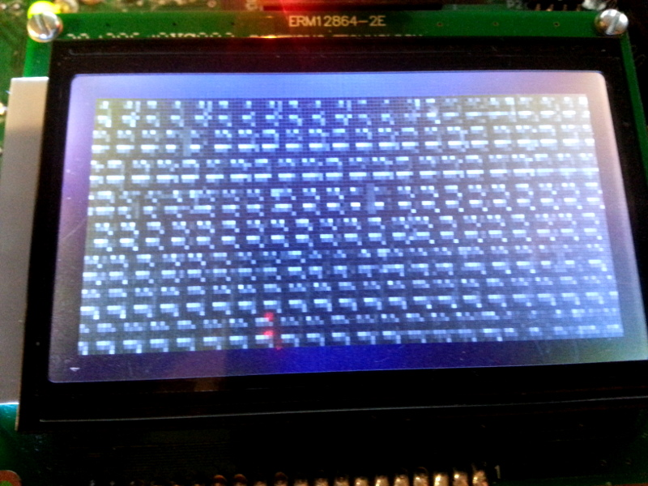

---
layout: learnpage
title: Clipping
--- 

This is a frightfully important beast that the stability of the platform
depends upon.  You see, at the end of the day, the frame buffer is still
just a big block of memory. And like a big block of anything, it has a
finite size. Why is that so important? Let's look at a hypothetical
memory map of our LameStation system.

<table>
<col width="100%" />
<tbody>
<tr class="odd">
<td align="left"><table>
<caption> </caption>
<tbody>
<tr class="odd">
<td align="left"></td>
</tr>
</tbody>
</table></td>
</tr>
</tbody>
</table>

Let's zoom in on the boundary between the framebuffer and the cat
pictures. A lot of people really like cats, and I'm sure if you liked
cats enough to load pictures of them onto your microcontroller, you
would probably be upset if something happened to them. When you are
copying from one area of memory to another, there is nothing at all to
stop you from writing into an area that you shouldn't be. This is not an
operating system; code execution doesn't run in a protected environment,
there isn't a memory manager that will throw up an exception for trying
to access areas not allocated to the application. It will just do it,
and it will either blow up your application, or it will silently corrupt
the internal state of your application, resulting in mysterious behavior
that doesn't seem to trace back to anything (the former situation is
nearly always a better one).

In the following picture, you can see one developer's careless sprite
blit on the right-hand side of the screen, not realizing the impending
catastrophe that will unfold. On the left, the image has been copied so
that it overflows the rightmost boundary of the screen. Luckily, since
it wasn't pasted directly on the bottom, there is more framebuffer left,
so it just spills over onto the left side of the screen, one row down.
This is annoying, but at least your program is still running. On the
right, the same developer decided to venture into the bottom-rightmost
corner of the screen with his ship or hedgehog or whatever he's making.
Only this time, there's no framebuffer left, so the blitting operation
spills over into an area of memory that isn't framebuffer at all. It may
have been free memory and nothing happened, or maybe it could have been
critical run-time code resulting in a fatal glitch. In this case, it was
a slideshow of your cat, which you may never see again (at least until
you reset).

<table>
<col width="100%" />
<tbody>
<tr class="odd">
<td align="left"><table>
<caption> </caption>
<tbody>
<tr class="odd">
<td align="left"></td>
</tr>
</tbody>
</table></td>
</tr>
</tbody>
</table>

<table>
<col width="100%" />
<tbody>
<tr class="odd">
<td align="left"><table>
<caption> </caption>
<tbody>
<tr class="odd">
<td align="left"></td>
</tr>
</tbody>
</table></td>
</tr>
</tbody>
</table>

This is why sprite clipping is so important. Failure to take into
account where the frame buffer begins and ends could result in Fluffy
being overwritten, and if Fluffy were an implementation of a
path-finding algorithm instead of a static cat, you'd be sad to find
that not only is Fluffy not getting your character where he or she needs
to be, but your application has probably already erupted in chaos as
strange patterns fill your screen and loud noises come from the
speakers.

So how do we protect Fluffy? It's simple; we add extra code to our
drawing routines that checks the location we are blitting to and the
size of the screen against the size of the sprite we are blitting. If
this code determines that the resulting operation would copy data
outside the region of the screen we want it to, it will adjust the
parameters to only copy the portion of the image that we want.

<table>
<col width="100%" />
<tbody>
<tr class="odd">
<td align="left"><table>
<caption> </caption>
<tbody>
<tr class="odd">
<td align="left"></td>
</tr>
</tbody>
</table></td>
</tr>
</tbody>
</table>

So should we go ahead and implement clipping on every graphics function
we ever write? Not necessarily. The only problem with this solution is
that it takes time to execute, like anything else. In an environment
like this, where we are very resource-constrained and trying to make
every byte and cycle count, it is always a trade-off between safety and
speed.

Mandatory screen clipping may ensure that you don't write to any areas
you aren't supposed to, if it slows down your application to be
unplayable, and you *know* that your particular game will never need to
draw less than the entire image, just forget about it. But if you want
to scroll through luscious terrains and beautiful landscapes, dodge
bullets and fly past enemies, it just doesn't look right to have objects
spontaneously disappear as they reach the edge of the screen instead of
exiting gracefully. With this in mind, all LameGFX sprite drawing
commands support sprite clipping as a settable option, because
a properly clipped cat is a happy cat.
