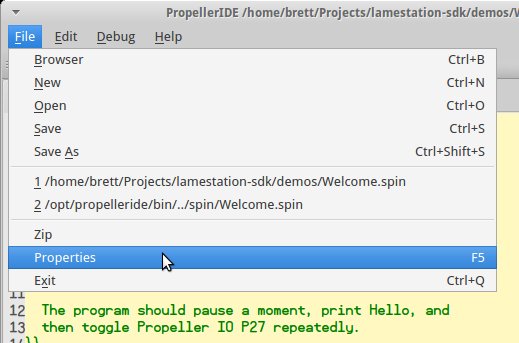
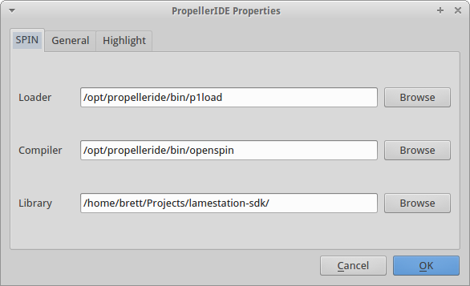

---
layout: learnpage
title: Download-And-Setup
--- 
------------------

1.  First things first. Download the SDK!   

    
      
     Or developers can get it directly using Git:

        git clone https://github.com/lamestation/lamestation-sdk.git

2.  [Install
    PropellerIDE](https://lamestation.atlassian.net/wiki/display/PI/Downloads)
    for your platform.

3.  Open PropellerIDE and go to " *File -\> Properties* ".   
     
4.  Under the Spin tab, type or browse to the path to where you've
    unpacked the SDK.   
     
5.  Your PropellerIDE is now set up for use with the LameStation SDK.

