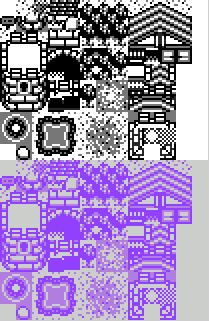

---
layout: learnpage
title: Frames
--- 

    img2dat tiles_2b_poketron.png -d -f 8 8

LameGFX sprites support frames, which allow the grouping of related
sprites into one source image. All mutli-frame images (tiles and
sprites) are handled the same way, cut from the image in a
left-to-right, top-to-bottom fashion, resulting in tiles being organized
linearly in the output data file.

<table>
<col width="100%" />
<tbody>
<tr class="odd">
<td align="left"><table>
<caption> </caption>
<tbody>
<tr class="odd">
<td align="left"></td>
</tr>
</tbody>
</table></td>
</tr>
</tbody>
</table>

By default, all images use a framesize equal to the size of the image,
resulting in one frame. You can change the size of the frame by passing
the `    --framesize   ` ( `    -f   ` ) option to `    img2dat   ` .
