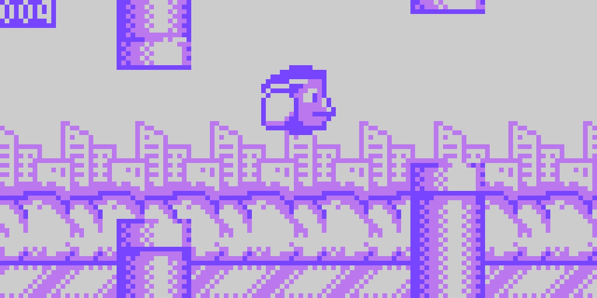

---
layout: learnpage
title: LameGFX
--- 

LameGFX provides a fast sprite drawing engine along with supporting
commands for the 3-color graphics format native to the LameStation.

There is no concept of sprite layers in LameGFX; you get a buffer and
you draw to it. Have fun!

# Commands

### [gfx.Start](gfx.Start.html)

Initialize the LameGFX drawing library.

### [gfx.ClearScreen](gfx.ClearScreen.html)

Fill the screen with a repeating word of color data specified by color.

### [gfx.Blit](gfx.Blit.html)

Copy a screen-sized (128x64) image to the screen.

### [gfx.Sprite](gfx.Sprite.html)

Draw an image of any size to the screen.

### [gfx.Map](gfx.Map.html)

Draw a tile-based level map at the specified coordinates.

### [gfx.InvertColor](gfx.InvertColor.html)

Invert black and white pixels sprite drawing.

### [gfx.SetClipRectangle](gfx.SetClipRectangle.html)

Change the portion of the screen that will be drawn to by LameGFX.

### [gfx.WaitToDraw](gfx.WaitToDraw.html)

Wait until the last drawing operation has completed before continuing.

### [gfx.LoadFont](gfx.LoadFont.html)

Load a font for drawing text.

### [gfx.PutChar](gfx.PutChar.html)

Draws a single character onto the screen at position (x, y).

### [gfx.PutString](gfx.PutString.html)

Draw a single-line string to the screen.

### [gfx.TextBox](gfx.TextBox.html)

Draw a string to the screen.
