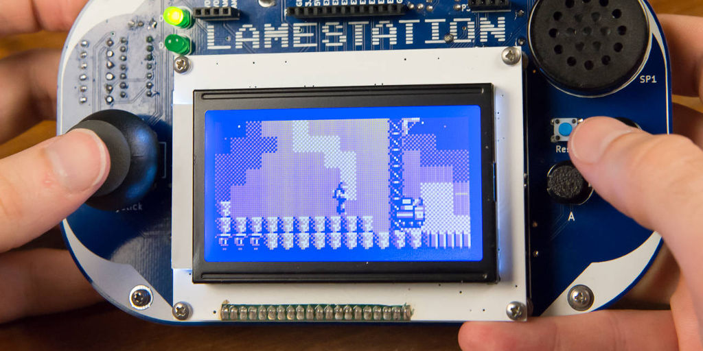

---
layout: learnpage
title: LameLCD
--- 

LameLCD provides a **3-color buffered display driver** for monochrome
KS0108 LCDs. Which is awesome!

# Commands

### [lcd.Start](lcd.Start.html)

Initialize the LameLCD library.

### [lcd.DrawScreen](lcd.DrawScreen.html)

Show the contents of the drawing buffer on the screen.

### [lcd.InvertScreen](lcd.InvertScreen.html)

Invert black and white pixels on the entire screen.

### [lcd.SetFrameLimit](lcd.SetFrameLimit.html)

Set an upper limit to the number of times the screen will be redrawn a
second.

### [lcd.WaitForVerticalSync](lcd.WaitForVerticalSync.html)

Wait until the start of the next LCD frame before continuing.
