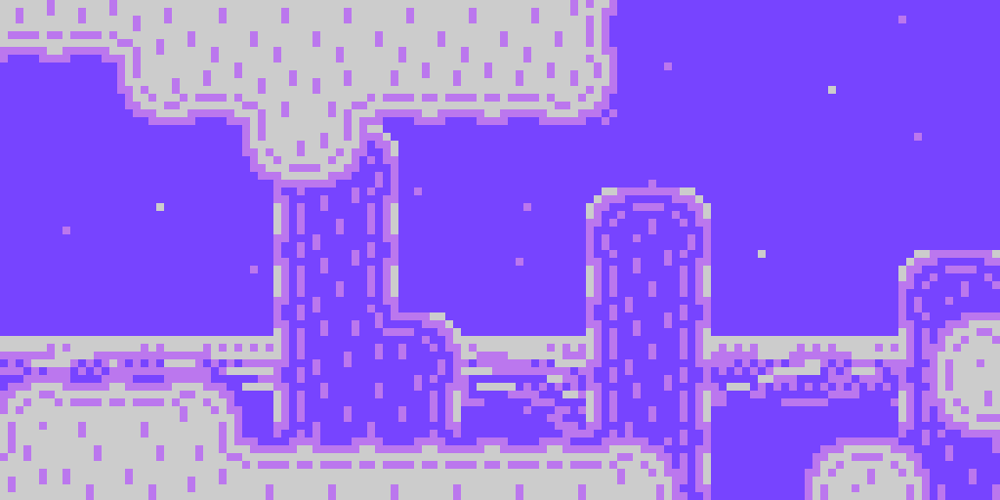

---
layout: learnpage
title: LameMap
--- 

LameMap allows you to incorporate SWEET tile-based maps into your games.
Create your maps with
[Tiled](https://lamestation.atlassian.net/wiki/display/LP/Making+Maps+With+Tiled)
and then you can use them right away.

Thanks to the free-form design of the LameStation, there's no such thing
as a tile or sprite layer, so you can use maps however you like.

Possible ideas:

-   Parallax scroll multiple tile layers (seen above!)
-   Build a large enemy ship with graphics too big to store in one file.
-   Display multiple game views on the same screen.
-   **Advanced** : use the map engine to draw any kind of block-based
    game FAST (see Brettris in the example games!).

# Commands

### [map.Load](map.Load.html)

Load a map into LameMap for drawing to the screen.

### [map.Draw](map.Draw.html)

Draw the current map to the screen.

### [map.DrawRectangle](map.DrawRectangle.html)

Draw the current map to a portion of the screen.

### [map.GetWidth](map.GetWidth.html)

Return the width of the currently loaded map in tiles.

### [map.GetHeight](map.GetHeight.html)

Return the height of the currently loaded map in tiles.

### [map.TestCollision](map.TestCollision.html)

Test if the region has collided with a map tile.

### [map.TestMoveX](map.TestMoveX.html)

Apply horizontal movement to an object's position and test if it will
collide.

### [map.TestMoveY](map.TestMoveY.html)

Apply vertical movement to an object's position and test if it will
collide.

### [map.TestPoint](map.TestPoint.html)

Test whether tile on a map is collidable.
