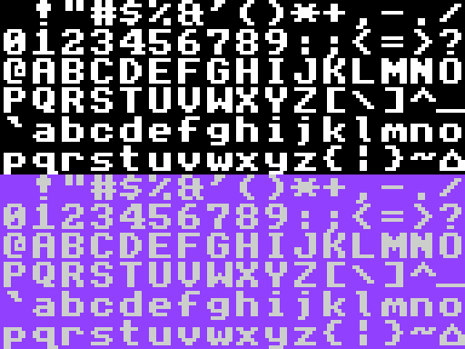
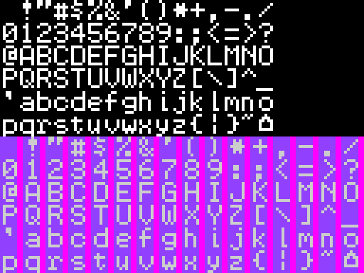

---
layout: learnpage
title: Padding
--- 

# Padding

All image widths must be rounded to the next nearest multiple of eight.
Therefore:

-   Multiple of 8 widths (8, 16, 24, ...) experience no rounding at all.
-   Everything else gets rounded up:
    -   7 -\> 8
    -   14 -\> 16
    -   2 -\> 8   

Let's take some example fonts.

-   For an **8x8 font** , no padding occurs and the image is subdivided
    normally, just like a regular sprite.

-   

-   For a **6x8 font** , each row of pixels in a given letter is only 6
    pixels, or 12 bits, so an additional 4 bits per line are added to
    make an even word.

    

