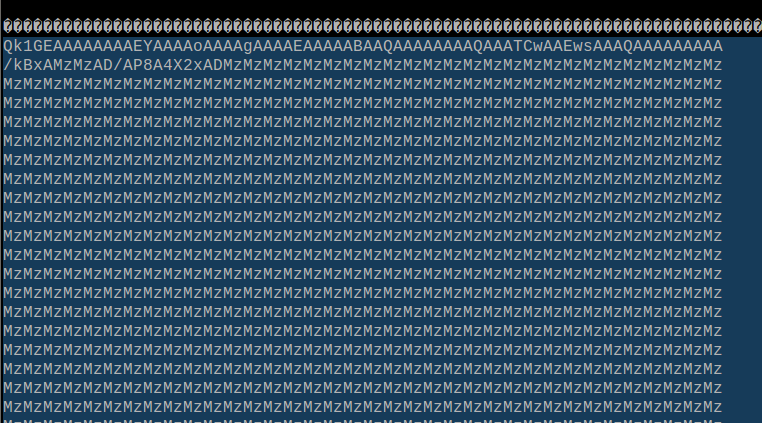
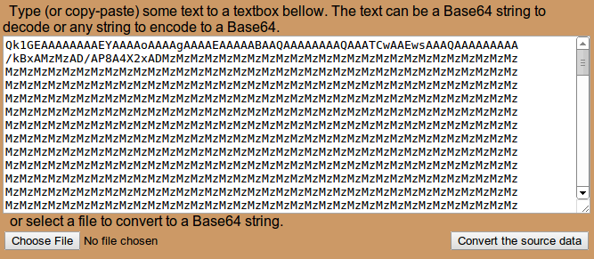
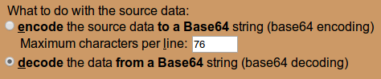
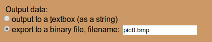

---
layout: learnpage
title: ScreenCapture
--- 

# ScreenCapture

This library can be used to capture images from the LameStation for use
in printed and web materials.

1.  Include the \*ScreenCapture\* object into your project (requires
    FullDuplexSerial).

        OBJ

            cap     : "ScreenCapture"

2.  Get access to the screen buffer.

        VAR
            word    buffer
        PUB Main
            buffer := gfx.Start
            lcd.Start(buffer)

3.  Pass the screen buffer address to the `      Capture     ` method
    when you wish to take a picture.

        cap.Capture(buffer)

    It's a good idea to find a way to control it, otherwise your
    application will run very slowly and taking pictures will be
    inconvenient. I usually put it behind a button.

                if ctrl.A
                    cap.Capture(buffer)}}

4.  Capture the BASE64-encoded output from the serial terminal (it's 78
    lines long)   
     
5.  Copy the output to [this
    tool](http://www.motobit.com/util/base64-decoder-encoder.asp) .   
     
6.  Select " **decode** the data **from a Base64** string (base64
    decoding)" **  
     **
7.  Select "export to a binary file" with a `     .bmp    ` extension.
      
     
8.  Click  to export the image to
    bitmap. It will be very small.   
     
9.  Apply the following shell script to the saved images to enlarge and
    convert to `      PNG     ` . You will need the
    **[convert](http://www.imagemagick.org/script/convert.php)** program
    from [ImageMagick](http://www.imagemagick.org/) installed.

        for f in *.bmp; do g=`echo $f | cut -d'.' -f 1`; convert $f -scale 512x256 $g.png ; done

10. Now your image should be awesomely awesome, and big enough for
    alias-free display on a website.   
     

