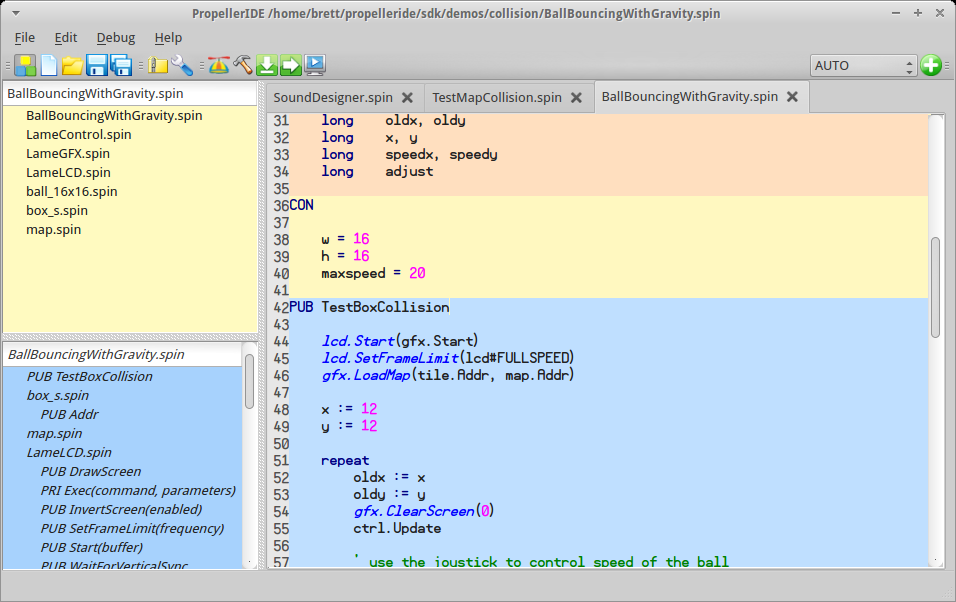
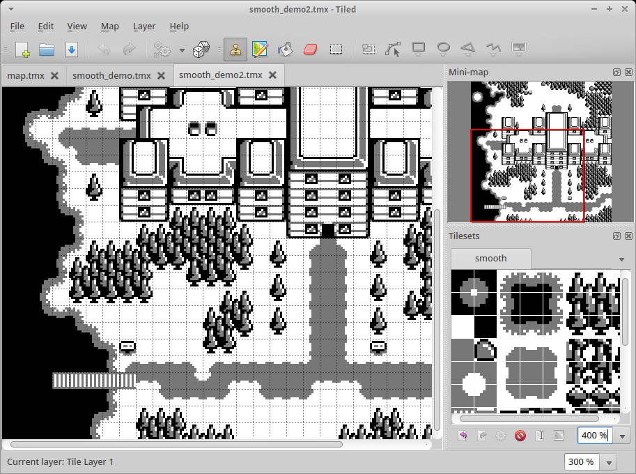
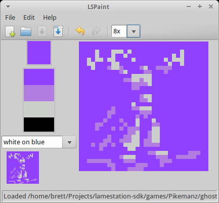
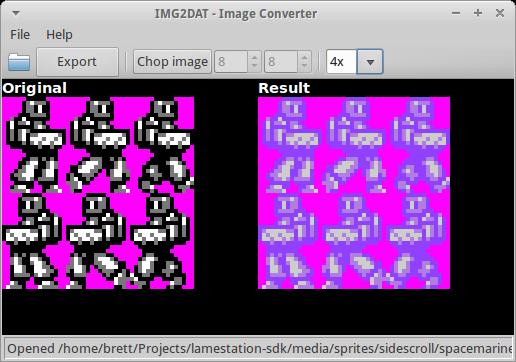

---
layout: learnpage
title: Tools
--- 

Tools
-----

Here you will find a complete list of available tools for working with
the LameStation.

 Graphical Tools

# RELEASED Propeller IDE

# *Spin code editor*

Check out the
[PropellerIDE](https://lamestation.atlassian.net/wiki/display/PI) space
to find out more.

# RELEASED Tiled

*Map editor*

# DEVELOPMENT LSPaint

*Paint Program*

# DEVELOPMENT IMG2DAT

*Image Converter for LameStation graphics*

 Command-Line Tools

# RELEASED img2dat

# RELEASED map2dat

# DEVELOPMENT wav2dat

# RELEASED frequencytiming
