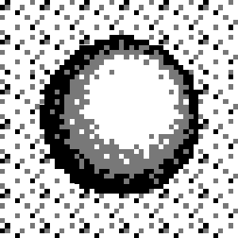

---
layout: learnpage
title: Transparency
--- 

# Transparency

Transparency allows us to address the limitations of using rectangular
data formats to store images.

Perhaps the simplest example of the problem is an image of a ball.

Without keying, the ball is drawn with the bounding box of the image,
appearing unsightly and out of place.

Source Image

Screen

Now let's add the transparent color into the source image. With keying,
the ball is just another part of the scene.

Source Image

Screen

All LameStation graphics share the same color format, and thus, all
support transparency. The transparent color is `    (255,0,255)   ` , or
pink.
