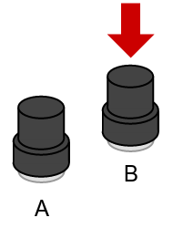

---
layout: learnpage
title: ctrl.B
--- 

Return the current state of the `'B'` button.

## Syntax

    B

This command takes no parameters, returns non-zero if button pressed,
zero otherwise.

## Description

This command returns the state of the `'B'` button. It requires
[ctrl.Update](ctrl.Update.html) to be called before it will return a
value.

<table>
<col width="100%" />
<tbody>
<tr class="odd">
<td align="left"><table>
<caption> </caption>
<tbody>
<tr class="odd">
<td align="left"></td>
</tr>
</tbody>
</table></td>
</tr>
</tbody>
</table>

## Example

        if ctrl.B
            JumpUp

See also: [ctrl.A](ctrl.A.html), [ctrl.Update](ctrl.Update.html).

