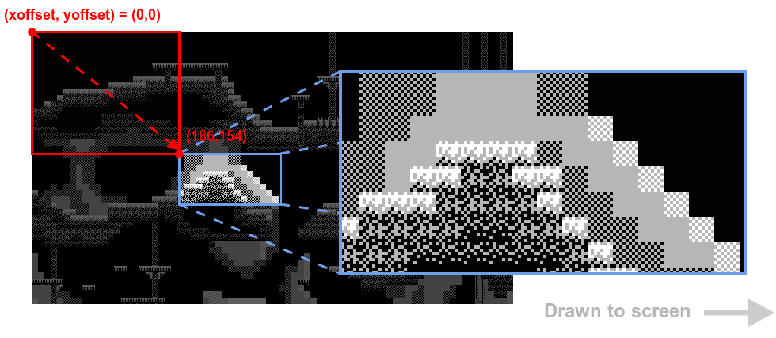

---
layout: learnpage
title: map.Draw
--- 

Draw the current map to the screen.

## Syntax

    Draw(xoffset, yoffset)

-   **xoffset** - Starting x position on map
-   **yoffset** - Starting y position on map

## Description

Draw a screen-sized region of the current map loaded by
`        LoadMap       ` , starting at
`        (xoffset, yoffset)       ` , to the screen.

xoffset and yoffset select a starting point on the level map from which
to draw the screen from. This is how you control which part of the level
to display.

<table>
<col width="100%" />
<tbody>
<tr class="odd">
<td align="left"><table>
<caption> </caption>
<tbody>
<tr class="odd">
<td align="left"></td>
</tr>
</tbody>
</table></td>
</tr>
</tbody>
</table>

## Example

    PUB Main
        lcd.Start(gfx.Start)                         ' setup screen and renderer
        map.Load(@gfx_data, @map_data)               ' prepare map

        repeat
            ' ...
            gfx.ClearScreen                          ' clear screen (map may be transparent)
            map.Draw(offsetx, offsety)               ' draw map
            ' ...
            ' ...
            lcd.DrawScreen                           ' update when ready

See also: [map.Load](map.Load.html) ,
[map.DrawRectangle](map.DrawRectangle.html) .

